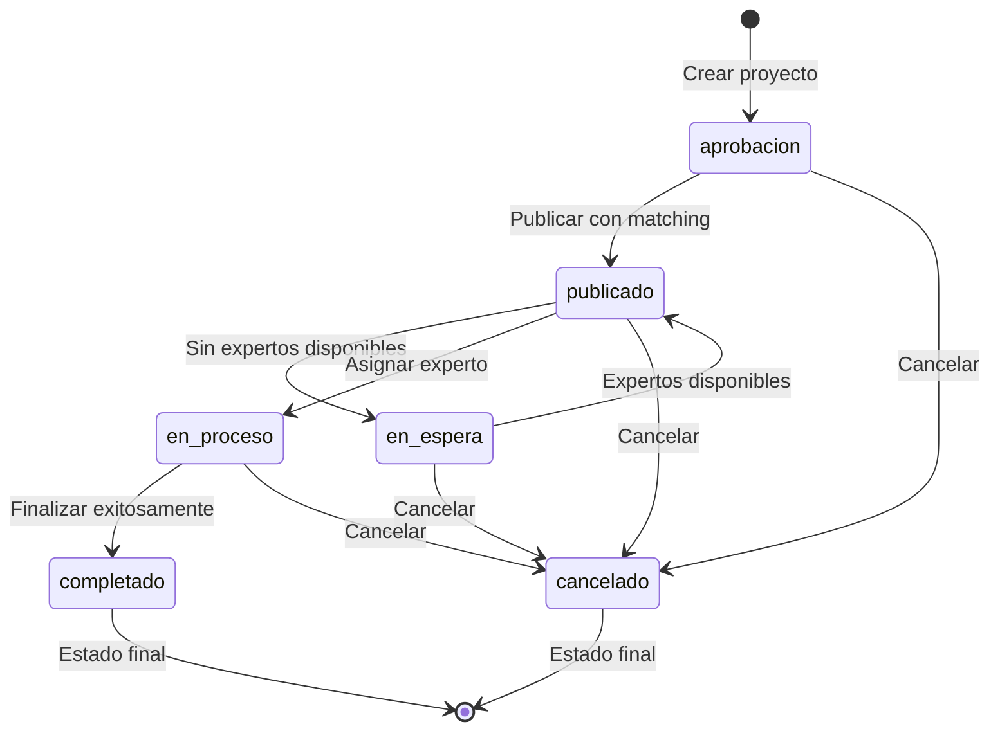

# Flujo de Estados de Proyectos

## Diagrama de Estados

## Descripción de Transiciones

### Desde `aprobacion`
- **→ `publicado`**: Proyecto aprobado y publicado con matching automático
- **→ `cancelado`**: Proyecto cancelado antes de publicación

### Desde `publicado`
- **→ `en_espera`**: No hay expertos disponibles para el matching
- **→ `en_proceso`**: Se asignó un experto al proyecto
- **→ `cancelado`**: Proyecto cancelado después de publicación

### Desde `en_espera`
- **→ `publicado`**: Expertos aprobados disponibles, re-publicar
- **→ `cancelado`**: Proyecto cancelado en espera

### Desde `en_proceso`
- **→ `completado`**: Proyecto finalizado exitosamente
- **→ `cancelado`**: Proyecto cancelado durante desarrollo

## Estados Finales
- **`completado`**: Proyecto terminado exitosamente
- **`cancelado`**: Proyecto cancelado por cualquier motivo

## Reglas de Negocio

1. **Solo el propietario** puede cambiar el estado de sus proyectos
2. **Estados finales** no pueden ser modificados
3. **Proyectos publicados** son visibles para expertos
4. **Matching automático** solo ocurre al publicar
5. **Fecha de publicación** se actualiza solo al cambiar a `publicado`
